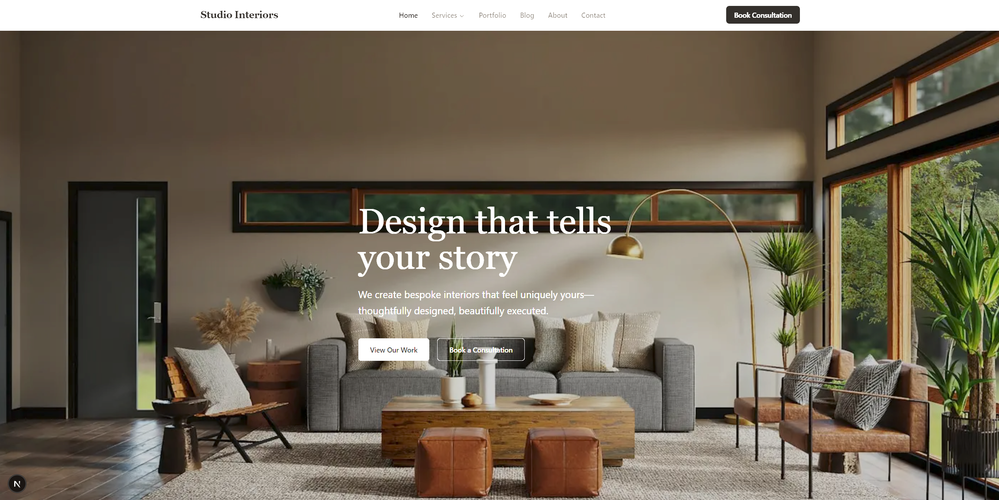
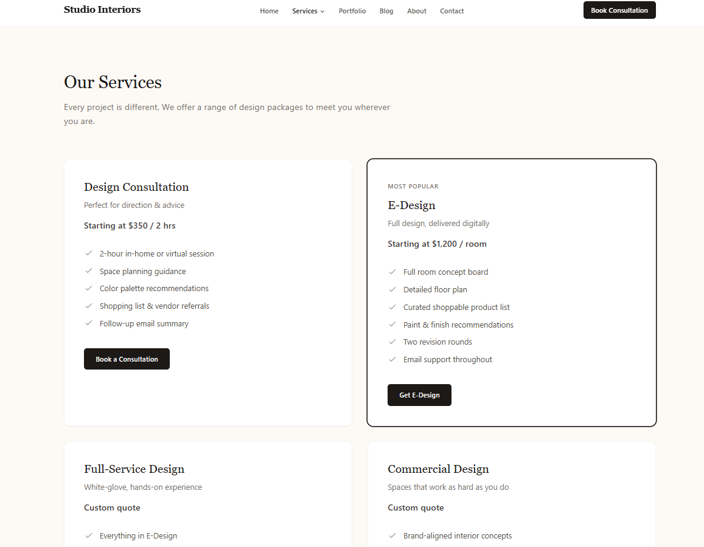
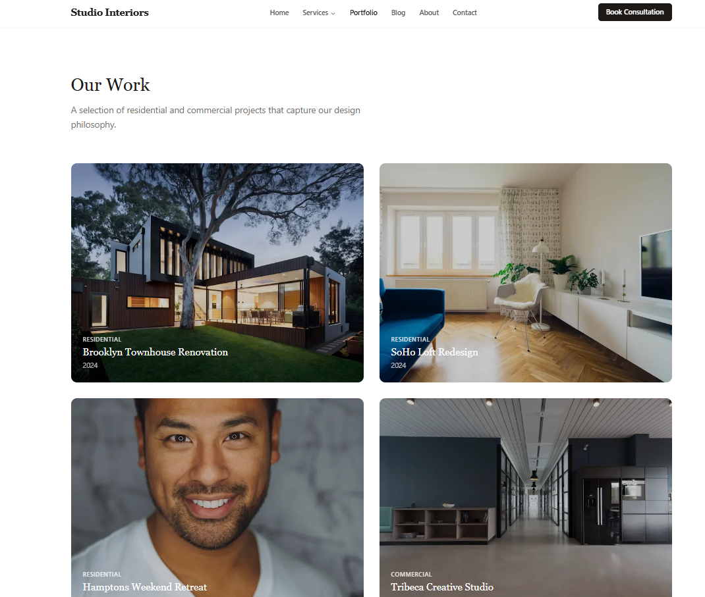
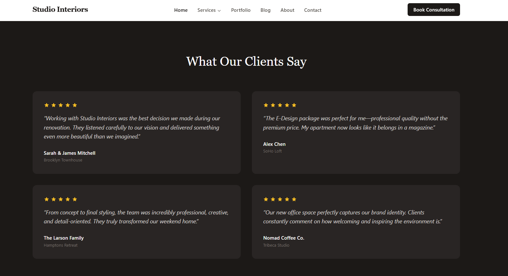
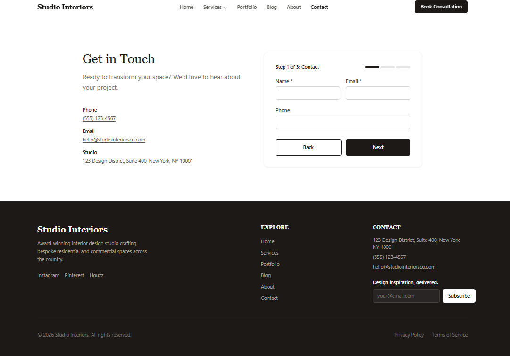
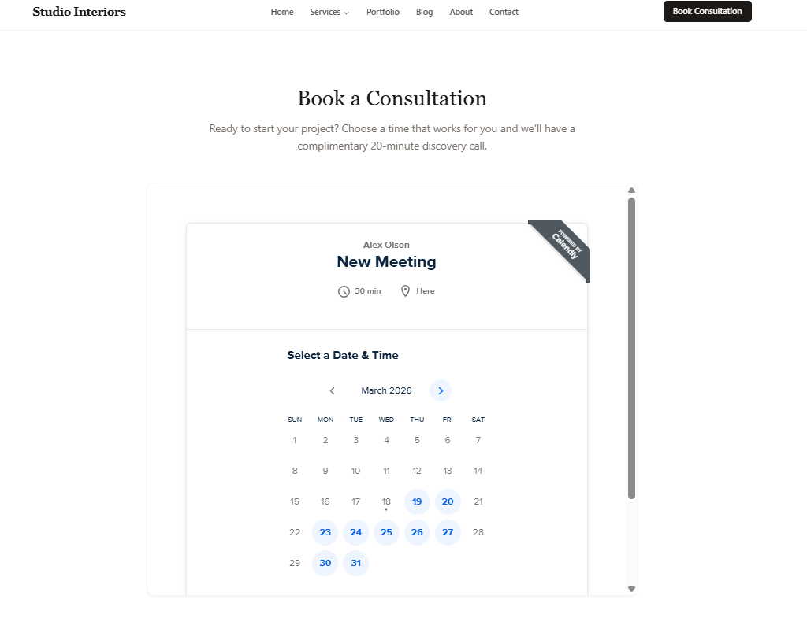

# Studio Interiors

**Live URL:** *(pending deployment)*
**Role:** Developer (design & build)
**One-liner:** Full-stack website and client portal for a Winston-Salem interior design studio

---

## Description

Studio Interiors is a boutique interior design firm serving the Winston-Salem, NC area, offering consultations through full-service residential and commercial projects. The client needed a polished website to showcase their portfolio, let prospective clients book consultations, and give existing clients a private portal to track project milestones and design approvals.

I designed and built the site using Next.js 15, Tailwind CSS, and a warm stone/cream color palette with Playfair Display and Inter typography. The backend runs on PostgreSQL via Prisma, with JWT auth for an admin dashboard and a magic-link client portal. Nodemailer handles transactional emails, and the admin dashboard gives the owner full control over inquiries, bookings, subscribers, blog posts, and client projects.

## Tech Stack

| Layer | Technology |
|-------|-----------|
| Framework | Next.js 15 (App Router) + React 19 |
| Language | TypeScript |
| Styling | Tailwind CSS |
| Database | PostgreSQL + Prisma ORM |
| Authentication | jose (JWT) — admin + client magic-link |
| Email | Nodemailer (SMTP) |
| Hosting | Netlify |

## Key Features

- **Multi-step contact form** — three-stage lead capture with email confirmations to both user and admin
- **Consultation booking with Calendly integration**
- **Admin dashboard** — metrics, inquiries, bookings, newsletter subscribers, blog CMS, and project management
- **Magic-link client portal** — passwordless auth; clients view milestones, approvals, and status updates
- **Blog CMS** — full post management with cover images, categories, and tags
- **Tiered service pricing cards** — four tiers with highlighted "Most Popular" option
- **Responsive mobile-first layout**

## Quick Stats

| Metric | Value |
|--------|-------|
| Public pages | 10+ |
| Admin pages | 8 |
| Client portal pages | 3 |
| API routes | 10 |
| Portfolio showcases | 4 |
| Testimonials | 4 |

## Screenshots

