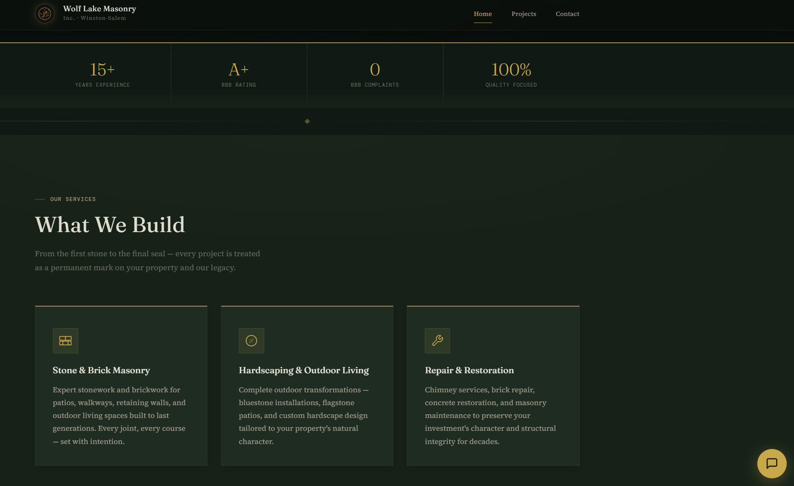
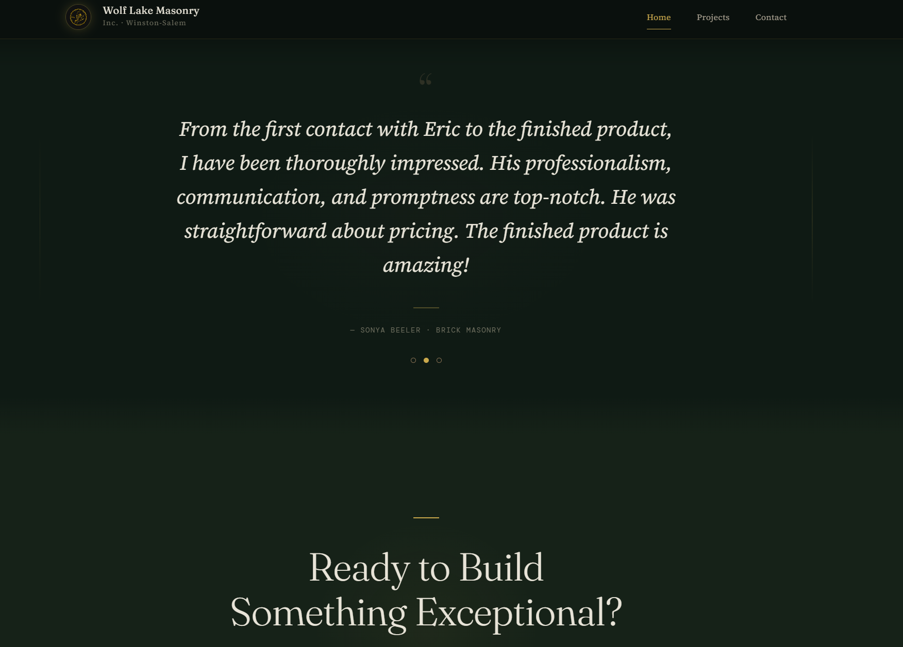
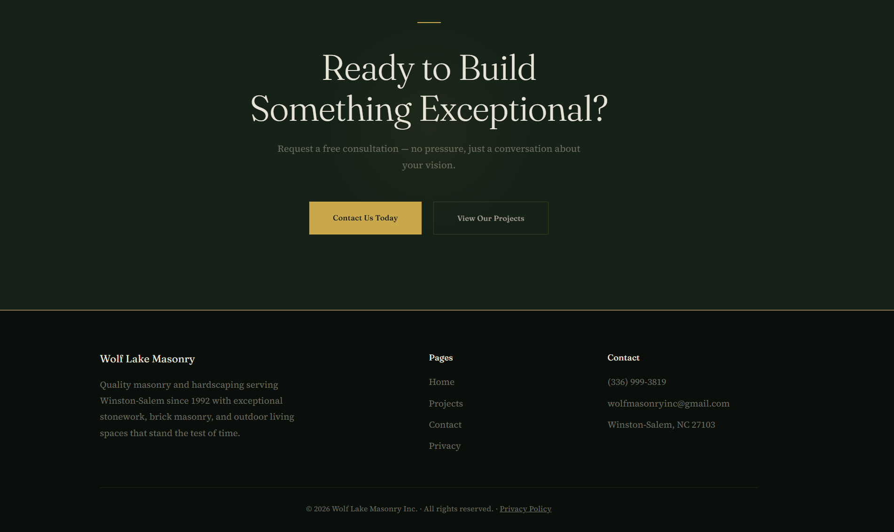
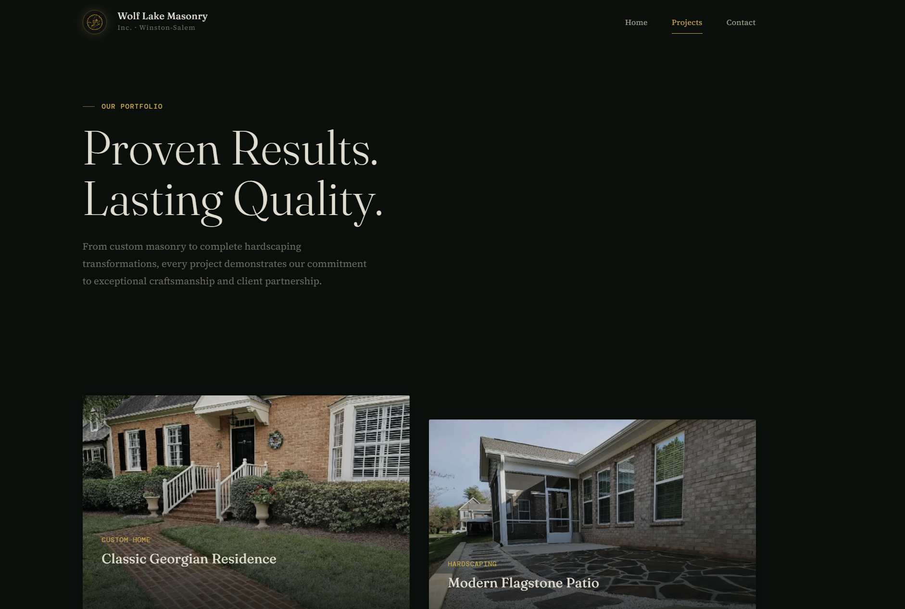
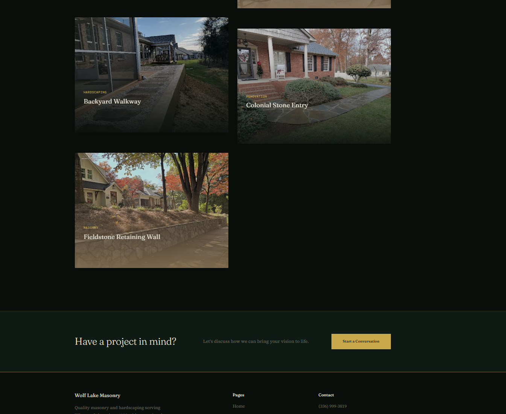
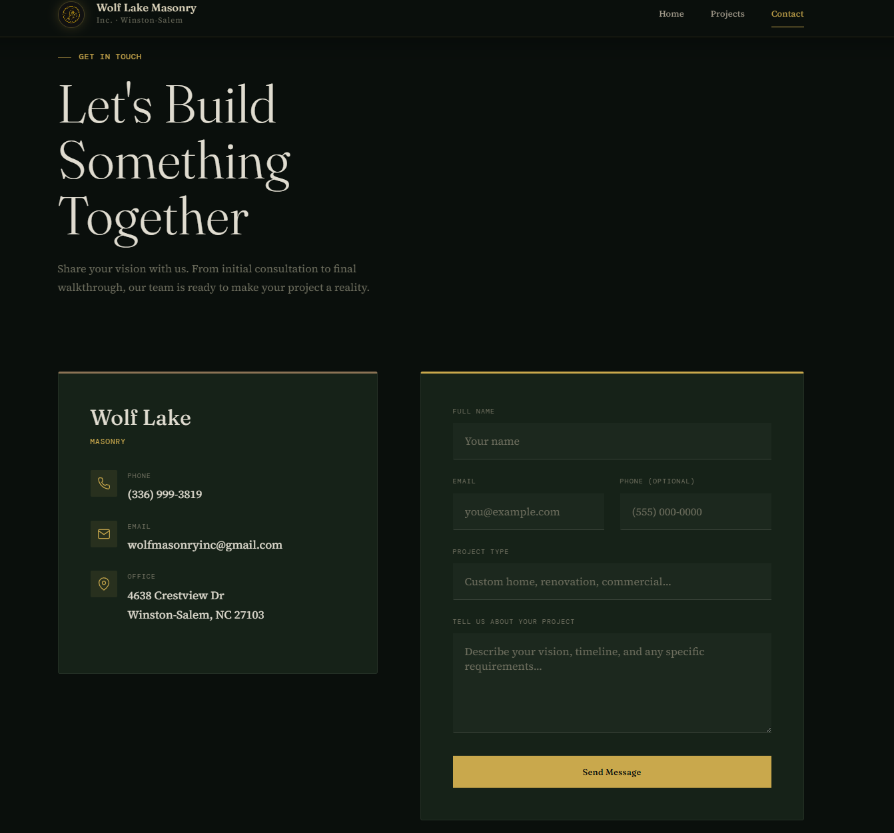

# Wolf Lake Masonry Inc.

**Live URL:** [www.wolflakemasonryinc.com](https://www.wolflakemasonryinc.com)
**Role:** Developer (design & build)
**One-liner:** Professional website for a Winston-Salem masonry & hardscaping company

---

## Description

Wolf Lake Masonry Inc. is a family-owned masonry and hardscaping business serving the Winston-Salem, NC area since 1992. The client needed a modern, professional web presence that would showcase their craftsmanship, build trust with homeowners, and generate quote requests — replacing an outdated setup with no online visibility.

I designed and built the site from scratch using React and a custom CSS design system called "Timberstone," inspired by the earthy materials the company works with daily. The result is a fast, mobile-friendly site with a dark forest/gold/stone color palette that reinforces the brand's rugged reliability. Netlify Forms handles lead capture with built-in spam filtering, and the site scores well on Core Web Vitals thanks to image optimization via Sharp and lazy loading throughout. Since launch, the site has become the client's primary source of new project inquiries.

## Tech Stack

| Layer | Technology |
|-------|-----------|
| Framework | React 18 + React Router v6 |
| Build | Vite 5 |
| Design | Custom "Timberstone" CSS design system |
| Hosting | Netlify (hosting + forms) |
| Image Pipeline | Sharp + vite-plugin-image-optimizer |
| Analytics | Google Analytics (GA4) |

## Key Features

- **Custom "Timberstone" design system** — dark forest/gold/stone palette with layered gradients, subtle glow effects, and cohesive typography
- **Scroll-triggered animated counters** — years of experience, BBB rating, projects completed, and satisfaction rate animate into view using IntersectionObserver
- **Auto-rotating testimonial carousel** — cycles through client reviews with smooth crossfade transitions
- **Netlify Forms integration** — contact form with honeypot spam filtering and custom success messaging
- **Responsive mobile-first layout** — hamburger nav, stacked sections, and touch-friendly tap targets across all breakpoints
- **Image optimization pipeline** — Sharp pre-processing + vite-plugin-image-optimizer for WebP/AVIF output and lazy loading
- **SEO essentials** — Open Graph tags, Twitter Cards, sitemap.xml, robots.txt, and semantic HTML throughout
- **Security headers** — X-Frame-Options, Content-Security-Policy, X-Content-Type-Options, and Referrer-Policy via Netlify config

## Quick Stats

| Metric | Value |
|--------|-------|
| Pages | 4 (Home, Projects, Contact, Privacy) |
| Project showcases | 7 |
| Testimonials | 3 |
| Notable highlight | A+ BBB Rating |

## Screenshots

